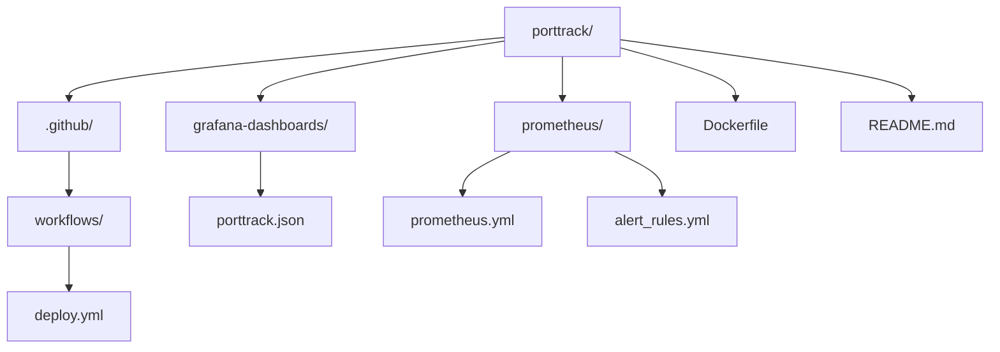

# 🚢 PortTrack - Estrategia de Despliegue y Monitoreo Continuo

Este repositorio contiene la solución propuesta para la Evaluación del Módulo 7 del Bootcamp DevOps, incluyendo la estrategia de despliegue continuo, configuración de entornos, monitoreo, automatización y ChatOps para la plataforma de navegación portuaria **PortTrack**.

---

## 📦 Estructura del Repositorio


---

## 🚀 Despliegue Continuo

Se implementa una estrategia **Blue-Green Deployment** utilizando:

- **GitHub Actions** como motor de CI/CD.
- **AWS CodeDeploy** para gestionar entornos y transición de tráfico.
- **Trivy** para escaneo de vulnerabilidades.
- **Docker** para empaquetado y despliegue de la aplicación.
  
El pipeline se encuentra configurado y funcional en cuanto a lógica y estructura, **pero actualmente no está activo en AWS**, ya que se omitió la configuración final de CodeDeploy, permisos IAM y buckets S3 requeridos para el despliegue automatizado. Esta parte puede activarse posteriormente integrando los servicios AWS correspondientes.


---

## 🔐 Configuración de Entornos

Los entornos definidos son:

- `DEV`: entorno local/desarrollo.
- `STAGING`: entorno espejo de producción para validación.
- `TEST`: entorno opcional para QA manual.
- `PRD`: entorno productivo, con despliegues seguros.

La gestión de secretos se realiza con **AWS Secrets Manager** y `GitHub Secrets`.

---

## 📊 Monitoreo Continuo

Se combinan herramientas open source y servicios en la nube:

- **Prometheus**: métricas del sistema.
- **Grafana**: visualización.
- **CloudWatch**: logs y alarmas en servicios AWS.
- **AlertManager**: notificaciones a Slack ante incidentes.

Incluye dashboards con CPU, latencia, errores y estado de servicios.

---

## 🤖 ChatOps

Se integra **Slack + Hubot** para automatizar operaciones desde el canal `#devops-porttrack`:

- `@hubot desplegar a staging`
- `@hubot rollback producción`
- `@hubot estado del sistema`

Todas las acciones quedan registradas y auditadas.

---

## 📎 Requisitos

- Node.js 18+
- Docker y Docker Compose
- Cuenta de AWS con permisos para ECR, CodeDeploy, CloudWatch
- Grafana + Prometheus (auto hospedado o en cloud)
- Slack App + Token para Hubot

---

## 🧪 Ejecución local (opcional)

```bash
# Construir imagen local
docker build -t porttrack .

# Ejecutar contenedor
docker run -p 3000:3000 porttrack
